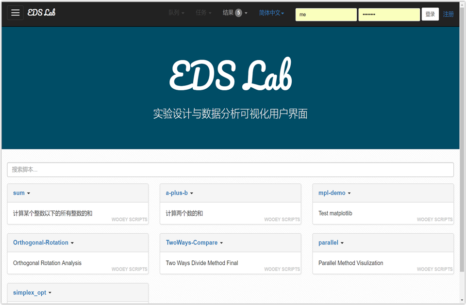

# EDS-lab

</img>

Experiment design assignment.  A Django site based on Wooey, to visualize the results of some algorithms. 

实验设计和数据处理的作业，搭建了一个基于Django框架和，开源项目Wooey的可视化界面，用来展示优选法可视化的实验结果。

| 实验方法和过程可视化结果（2维）                              | 实验方法和过程可视化结果（3维）                              |
| ------------------------------------------------------------ | ------------------------------------------------------------ |
| 2D                                                           | 3D                                                           |
| 双因素选升法2D </img> | 双因素选升法3D </img> |
| 双因素对开法2D </img> |                                                              |
| 双因素平行线法2D </img> |                                                              |
| </img>       |                                                              |

> 注：图标题并非几种方法的标准英文翻译。