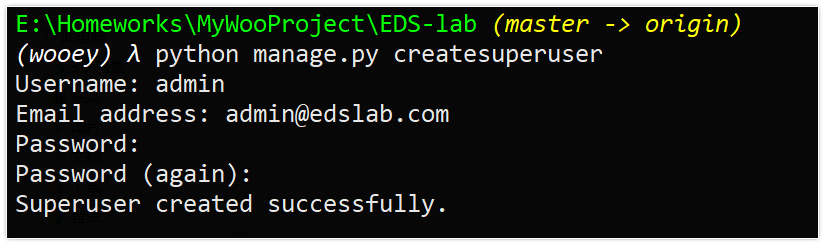
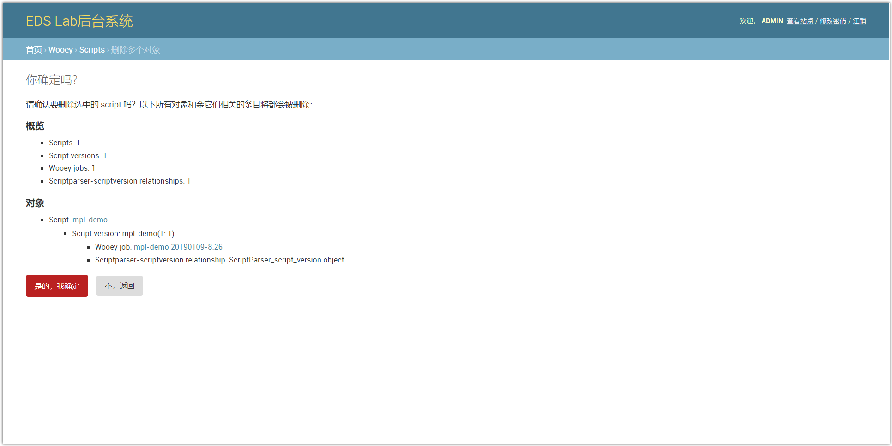
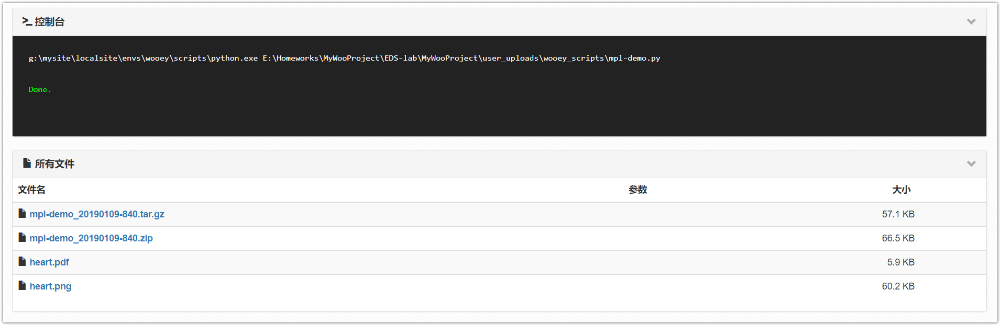

# 管理和运行

本项目的后台系统是基于Django的，这里已经为您创建了一个用户：

- 用户名 admin
- 密码 ADMIN12345678

你可以使用上述用户名和密码来执行相关管理工作，其中包括创建新的用户。


## 1.创建超级用户

超级用户即系统管理员，这里和所有django项目一样，在后台中输入`createsuperuser`进行管理员的创建。




## 2. 注册、登录后台管理系统


两种方式登录：

1. 在用户界面右上角输入用户名和密码
2. 或者在地址栏中输入`ip:端口号/admin`，输入用户名或密码登录。

系统也支持注册新用户并登录。


## 3. 用户管理


如上图所示可在后台进行用户管理。

## 4. 脚本管理





## 5. 增加脚本


有两种方式来增加脚本。第一种方式通过后台来添加（不推荐，没办法添加绝对路径，checksum无法计算，从而无法添加成功）。


另外一种通过终端来添加，在终端中输入:

```python
python manage.py addscript [path-to-script/]script.py
```

即`addscript`后接脚本的路径，出现`Concerted 1 scripts`表明添加成功。

> **特别注意**： 添加的脚本中不能含有中文，**包括注释**中都不能有中文等其他字符。


进入后台管理系统中，发现脚本被成功添加了进来，点击进入后可以修改脚本信息（非源程序）。


查看站点，发现有新的脚本被添加进来。

## 6. 运行脚本 




运行新脚本，结果如上图。


