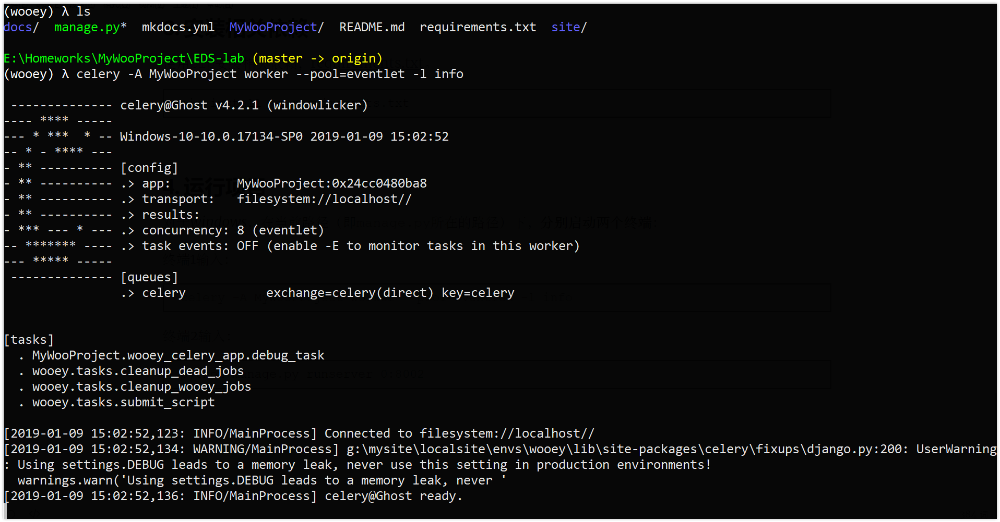

# 快速开始


## 安装Python和相关依赖

* `Python` - 推荐python3.6及以上
* `pip` - 推荐18.1及以上

* 其他：见文件`requirements.txt`，内容如下，安装请见后文：

```python
amqp==2.3.2
billiard==3.5.0.5
celery==4.2.1
Click==7.0
clinto==0.2.1
cycler==0.10.0
Django==1.11.17
django-autoslug==1.9.3
django-celery-results==1.0.4
dnspython==1.16.0
eventlet==0.24.1
greenlet==0.4.15
Jinja2==2.10
jsonfield==2.0.2
kiwisolver==1.0.1
kombu==4.2.2
livereload==2.6.0
Markdown==3.0.1
markdown-include==0.5.1
MarkupSafe==1.1.0
matplotlib==3.0.2
mkdocs==1.0.4
monotonic==1.5
numpy==1.15.4
pandas==0.23.4
pyparsing==2.3.0
pypiwin32==223
python-dateutil==2.7.5
pytz==2018.7
pywin32==224
PyYAML==3.13
scipy==1.2.0
seaborn==0.9.0
six==1.12.0
tornado==5.1.1
vine==1.1.4
wooey==0.10.0
```


## 运行使用

### 1.创建虚拟环境（非必须，推荐）

为了防止项目工程的依赖和用户自带的python环境相冲突，例如python版本不一致。建议为工程创建虚拟环境，创建方法见[virtualenv](https://virtualenv.pypa.io/en/latest/userguide/), 这里推荐使用[virtualenvwrapper](https://virtualenvwrapper.readthedocs.io/en/latest/install.html#basic-installation)，一个更快捷的`virtualenv`的封装来创建python3的虚拟环境。

例如，使用`virtualenvwrapper`创建了名称为`wooey`的python3环境，然后在这个环境下运行本项目。


### 2. 下载工程代码


下载地址：[EDS-lab](https://github.com/liuqidev/EDS-lab)

下载后解压，进入到`EDS-lab`路径下。


### 3. 安装相关依赖

使用`pip`安装相关依赖，[requirements.txt](requirements.txt)。

```python
pip install -r requirements.txt
```


### 4. 运行项目

对于*windows*，在当前路径（即`manage.py`所在的路径）下，**分别启动两个终端**：



终端1输入：

```powershell
celery -A MyWooProject worker --pool=eventlet -l info
```

效果入上图所示。


终端2输入：

```python
python manage.py runserver 0:8000
```

> 注：端口号可以任意指定。


对于Linux和其他操作系统，请查看[这里](https://wooey.readthedocs.io/en/latest/running_wooey.html#through-two-separate-processes)。

## 5.本地查看项目

通过步骤5就构建了一个本地服务器来运行本工程。


使用浏览器，输入`http://localhost:8000/`,即可查看工程。


## 6.运行脚本


点击脚本名称，输入相关参数，即可运行。例如上图是创建计算`[0, 100)`以内所有正数和的任务，点击提交。

