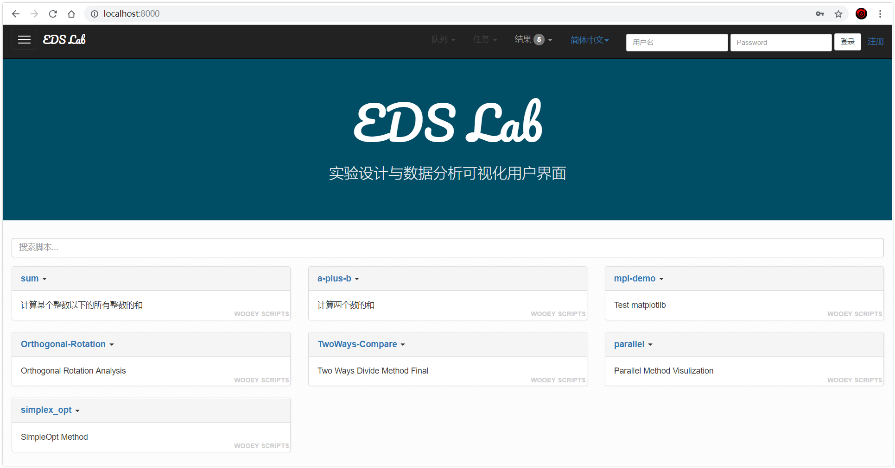
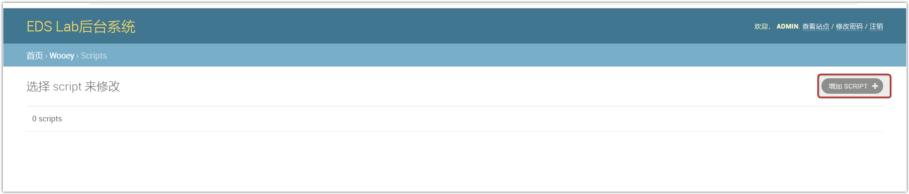

# EDS Lab 使用手册

[TOC]

实验设计和数据处理的作业，搭建了一个基于Django框架和，开源项目Wooey的可视化界面，用来展示优选法可视化的实验结果。

> 注意：本手册的word版本由相关软件导出，可能在格式问题，推荐查看其他格式（pdf, html）以及在线文档<https://eds-lab.readthedocs.io/zh/latest/>
> 。

## UI

<div width="50%">
<center ></img></center>
</div>


## 功能示例


## 部分结果 

|               实验方法和过程可视化结果（2维）                |               实验方法和过程可视化结果（3维）                |
| :----------------------------------------------------------: | :----------------------------------------------------------: |
|                              2D                              |                              3D                              |
| 双因素选升法2D</img> | 双因素选升法3D</img> |
| <center>双因素对开法2D</img></center> |                                                              |
| 双因素平行线法2D</img> |                                                              |
| 单纯形法2D</img> |                                                              |

> 注：图标题并非几种方法的标准英文翻译。


## 文档

[中文文档](http://eds-lab.readthedocs.io/)


## 证书

BSD


# 快速开始


## 0. 安装Python和相关依赖

* `Python` - 推荐python3.6及以上
* `pip` - 推荐18.1及以上

* 其他：见文件`requirements.txt`，内容如下，安装请见后文：

```python
Django
wooey
django-sslify
django-storages
django-celery
django-autoslug
boto
waitress
psycopg2
collectfast
honcho
```


## 1. 运行使用

### * 创建虚拟环境（非必须，推荐）

为了防止项目工程的依赖和用户自带的python环境相冲突，例如python版本不一致。建议为工程创建虚拟环境，创建方法见[virtualenv](https://virtualenv.pypa.io/en/latest/userguide/), 这里推荐使用[virtualenvwrapper](https://virtualenvwrapper.readthedocs.io/en/latest/install.html#basic-installation)，一个更快捷的`virtualenv`的封装来创建python3的虚拟环境。

例如，使用`virtualenvwrapper`创建了名称为`wooey`的python3环境，然后在这个环境下运行本项目。


## 2. 下载工程代码


下载地址：[EDS-lab](https://github.com/liuqidev/EDS-lab)

下载后解压，进入到`EDS-lab`路径下。


## 3. 安装相关依赖

使用`pip`安装相关依赖，[requirements.txt](requirements.txt)。

```python
pip install -r requirements.txt
```


## 4. 运行项目

对于*windows*，在当前路径（即`manage.py`所在的路径）下，**分别启动两个终端**：


终端1输入：

```powershell
celery -A MyWooProject worker --pool=eventlet -l info
```

效果入上图所示。


终端2输入：

```python
python manage.py runserver 0:8000
```

> 注：端口号可以任意指定。


对于Linux和其他操作系统，请查看[这里](https://wooey.readthedocs.io/en/latest/running_wooey.html#through-two-separate-processes)。

## 5.本地查看项目

通过步骤5就构建了一个本地服务器来运行本工程。



使用浏览器，输入`http://localhost:8000/`,即可查看工程。


## 6. 运行实验脚本


点击脚本名称，输入相关参数，即可运行。例如上图是创建计算`[0, 100)`以内所有正数和的任务，点击提交，任务会被添加到任务队列中，等待片刻，结果输出到界面，结果产生的文件以列表形式陈列于下方。

运行其他脚本过程类似。


# 管理和运行

本项目的后台系统是基于Django的，这里已经为您创建了一个用户：

- 用户名 admin
- 密码 ADMIN12345678

你可以使用上述用户名和密码来执行相关管理工作，其中包括创建新的用户。


## 1.创建超级用户

超级用户即系统管理员，这里和所有django项目一样，在后台中输入`createsuperuser`进行管理员的创建。


## 2. 注册、登录后台管理系统


两种方式登录：

1. 在用户界面右上角输入用户名和密码
2. 或者在地址栏中输入`ip:端口号/admin`，输入用户名或密码登录。

系统也支持注册新用户并登录。


## 3. 用户管理


如上图所示可在后台进行用户管理。

## 4. 脚本管理


## 5. 增加脚本




有两种方式来增加脚本。第一种方式通过后台来添加（不推荐，没办法添加绝对路径，checksum无法计算，从而无法添加成功）。


另外一种通过终端来添加，在终端中输入:

```python
python manage.py addscript [path-to-script/]script.py
```

即`addscript`后接脚本的路径，出现`Concerted 1 scripts`表明添加成功。

> **特别注意**： 添加的脚本中不能含有中文，**包括注释**中都不能有中文等其他字符。


进入后台管理系统中，发现脚本被成功添加了进来，点击进入后可以修改脚本信息（非源程序）。


查看站点，发现有新的脚本被添加进来。

## 6. 运行脚本 


运行新脚本，结果如上图。


# 功能特性


1. 可以运行任何python脚本
2. 脚本参数可调整
3. 脚本可重复运行，可查看管理历史结果
4. 良好的交互，美观的界面
5. 良好的算法可视化效果
6. 方便的后台管理
7. 基于B/S，部署后随处可访问
8. 支持多用户访问，运行结果互不干扰
9. 完全开源，方便扩展开发
10. 运行结果文件轻松下载


## 相关技术和工具


# 常见问题


## Q1. UnicodeDecodeError: 'gbk' codec can't decode byte 0x80 in position xxx: illegal multibyte sequence

上面表示脚本中含有`gbk`编码的字符，这里需要注意，添加的脚本中不能有中文（这是一个bug，目前还没修复），中文不能存在于python程序的任何地方，包括注释中。所以需要检查代码，将相应的字符删除或者替换成英文。


## Q2. 如何为脚本增加参数控制？

程序通过`argparse`来进行参数调节和解析，下方是一个示例：

```python
// a_plus_b.py
import argparse
import sys

# parser and arguments
parser = argparse.ArgumentParser(description='a plus b problem')
parser.add_argument('--a', help='first num', type=int, default=0)
parser.add_argument('--b', help='second num', type=int, default=0)

def main():
    args = parser.parse_args()
    a = args.a
    b = args.b
    sum = a + b
    print('{0} + {1} = {2}'.format(a, b, sum))
    return 0


if __name__ == "__main__":
    sys.exit(main())
    #main()
```

你可以通过命令行来运行，

```python
python a_plus_b.py
>>> 0

python a_plus_b.py --a 1 --b 2
>>> 3
```

项目中更改脚本参数的逻辑和上面一致。

关于`argparse`，[查看更多](https://docs.python.org/3/library/argparse.html)。


> ## Q3. 算法可视化中的动画是如何做到的？

动画使用的是[Matplotlib](https://matplotlib.org/)中的[animation](https://matplotlib.org/api/_as_gen/matplotlib.animation.FuncAnimation.html#examples-using-matplotlib-animation-funcanimation)。

例如本项目中`双因素旋升法`，二维动画生成，核心代码如下，

```python
def init2D():
    line.set_data([], [])
    point.set_data([], [])
    value_display.set_text('')
    return line, point, value_display


def animate2D(i):
    line.set_data(track_x[i], track_y[i])

    point.set_data(track_x[i], track_y[i])
    # point.set_data(track_x[i], track_y[i], track_z[i])

    value_display.set_text('Iteration: ' + str(i + 1) +
                           '\n'
                           r'$x(\alpha_1)= $' '{0:.4f}'.format(
                               track_x[i][1]) + r' $x(\alpha_2)= $' '{0:.4f}'.format(
        track_x[i][2]) +
                           '\n'
                           r'$y(\alpha_1)= $' '{0:.4f}'.format(
                               track_y[i][1]) + r' $y(\alpha_2)= $' '{0:.4f}'.format(
        track_y[i][2]) +
                           '\n'
                           r'$z(\alpha_1)= $' '{0:.4f}'.format(
                               track_z[i][1]) + r' $z(\alpha_2)= $' '{0:.4f}'.format(
        track_z[i][2])
                           )

    return line, point, value_display
```

```python
# 2D
fig = plt.figure(figsize=(8, 8))
# ax1 = Axes3D(fig)
ax1 = plt.gca()
ax1 = snapshot2D(ax1)

line, = ax1.plot([], [], 'r', label='Domain', lw=1.5)
point, = ax1.plot([], [], 'bo', c='b', label='Experiments')
value_display = ax1.text(0.02, 0.08, '', transform=ax1.transAxes)

ax1.legend(loc=1)
ax1.grid(False)

anim2D = animation.FuncAnimation(fig, animate2D, init_func=init2D,
                                 frames=len(track_x),
                                 interval=500,
                                 repeat_delay=80, blit=True)

Writer2D = animation.writers['ffmpeg']
FPS_2D = 5
writer2D = Writer2D(fps=FPS_2D, metadata=dict(artist='L'), bitrate=1800)
# anim.save('Orthogonal-Rotation-004.gif',writer='imagemagick', fps=60)
print('Creating 2D Animation VIDEO ...')
anim2D.save('Orthogonal-Rotation-2D-fps{0}.mp4'.format(FPS_2D), writer=writer2D)
print('Done.\nCreating 2D Animation GIF ...')
anim2D.save('Orthogonal-Rotation-2D-fps{0}.gif'.format(FPS_2D), writer='imagemagick', fps=FPS_2D)
print('Done\n2D Animation Created.')
plt.savefig('Orthogonal-Rotation-2D.pdf')
plt.savefig('Orthogonal-Rotation-2D.png')
```

其中`snapshot2D`为生成函数的等高线图，将`ax`（matplotlib中的坐标轴类）的对象传回，再在该轴上绘制其他图像，也可以同时绘制。

```python

def snapshot2D(ax):
    a = np.linspace(scope_x[0] - 0.2, scope_x[1] + 0.2, num_divs)
    b = np.linspace(scope_y[0] - 0.2, scope_y[1] + 0.2, num_divs)
    x, y = np.meshgrid(a, b)
    # z=func(x,y)
    # ax.contour(x, y,z, levels=np.logspace(-3,3,25), cmap='jet')
    ax.contourf(x, y, func(x, y), 50, cmap=cm.hot, alpha=0.7)
    CS = ax.contour(x, y, func(x, y), 15, colors='k')
    ax.clabel(CS, inline=True, fontsize=13)
    ax.set_xlabel(r'x', fontdict={'fontsize': 18, 'fontweight': 'medium'})
    ax.set_ylabel(r'y', fontdict={'fontsize': 18, 'fontweight': 'medium'})

    ax.set_title(r'Orthogonal Rotation Analysis $f(x,y)$', fontdict={'fontsize': 20, 'fontweight': 'medium'})
    ax.xaxis.set_tick_params(labelsize=18)
    ax.yaxis.set_tick_params(labelsize=18)

    # ax.plot(final_x, final_y, marker='*', c='r', markersize=15)
    ax.scatter(final_x, final_y, marker='*', c='r', s=50, label='Final Result')

    return ax
```


3D的动画生成逻辑相同。

```python

def init3D():
    line.set_data([], [])
    line.set_3d_properties([])
    point.set_data([], [])
    point.set_3d_properties([])

    point1.set_data([], [])
    point1.set_3d_properties([])

    point2.set_data([], [])
    point2.set_3d_properties([])

    point3.set_data([], [])
    point3.set_3d_properties([])

    display_value.set_text('')

    # return line, point, display_value
    return line, point, point1, point2, point3, display_value


def animate3D(i):
    line.set_data(track_x[i], track_y[i])
    line.set_3d_properties(track_z[i])

    point.set_data(track_x[i], track_y[i])
    point.set_3d_properties(track_z[i])

    point1.set_data(track_x[i], track_y[i])
    point1.set_3d_properties([-0.5] * len(track_x[i]))

    # point2.set_data(scope_x[0]* len(track_x[i]), track_y[i]) # a bug here
    # point2.set_3d_properties(track_z[i])
    point2.set_data([scope_x[0] - 0.3] * len(track_x[i]), track_y[i])
    point2.set_3d_properties(track_z[i])

    point3.set_data(track_x[i], [scope_y[1] + 0.3] * len(track_x[i]))
    point3.set_3d_properties(track_z[i])

    display_value.set_text('Iteration: ' + str(i + 1) +
                           '\n'
                           r'$x(\alpha_1)= $' '{0:.4f}'.format(track_x[i][1]) + r' $x(\alpha_2)= $' '{0:.4f}'.format(
        track_x[i][2]) +
                           '\n'
                           r'$y(\alpha_1)= $' '{0:.4f}'.format(track_y[i][1]) + r' $y(\alpha_2)= $' '{0:.4f}'.format(
        track_y[i][2]) +
                           '\n'
                           r'$z(\alpha_1)= $' '{0:.4f}'.format(track_z[i][1]) + r' $z(\alpha_2)= $' '{0:.4f}'.format(
        track_z[i][2]))

    # return line, point, display_value
    return line, point, point1, point2, point3, display_value
```

```python
# 3D
fig1 = plt.figure(figsize=(8, 8))
ax2 = Axes3D(fig1)
ax2 = snapshot3D(ax2)

line, = ax2.plot([], [], [], 'r-', label='Domain', lw=1.5)
point, = ax2.plot([], [], [], 'bo', markersize=10, label='Experiments')  # on the surface
point1, = ax2.plot([], [], [], 'ro', markersize=10, alpha=0.2)  # projection to z
point2, = ax2.plot([], [], [], 'ro', markersize=10, alpha=0.2)  # projection to x
point3, = ax2.plot([], [], [], 'ro', markersize=10, alpha=0.2)  # projection to y

display_value = ax2.text(scope_x[1], scope_y[1], final_z + 0.5, '', transform=ax2.transAxes)
ax2.grid(False)
ax2.legend(loc=1)

anim = animation.FuncAnimation(fig1, animate3D, init_func=init3D,
                               frames=len(track_x),
                               interval=1000,
                               repeat_delay=80, blit=True)

Writer3D = animation.writers['ffmpeg']
FPS_3D = 5
writer3D = Writer3D(fps=FPS_3D, metadata=dict(artist='L'), bitrate=1800)
# anim.save('Orthogonal-Rotation-004.gif',writer='imagemagick', fps=6)
print('Creating 3D Animation VIDEO ...')
anim.save('Orthogonal-Rotation-3D-fps{0}.mp4'.format(FPS_3D), writer=writer3D)
print('Done.\nCreating 3D Animation GIF ...')
anim.save('Orthogonal-Rotation-3D-fps{0}.gif'.format(FPS_3D), writer='imagemagick', fps=FPS_3D)
print('Done\n3D Animation Created.')
plt.savefig('Orthogonal-Rotation-3D.pdf')
plt.savefig('Orthogonal-Rotation-3D.png')
# plt.show()
```

其中``snapshot3D`:

```python

def snapshot3D(ax):
    a = np.linspace(scope_x[0] - 0.2, scope_x[1] + 0.2, num_divs)
    b = np.linspace(scope_y[0] - 0.2, scope_y[1] + 0.2, num_divs)
    X, Y = np.meshgrid(a, b)
    Z = func(X, Y)

    # ax.plot_surface(X, Y, Z, rstride=1, cstride=1, edgecolor='none', cmap='jet')
    ax.plot_wireframe(X, Y, Z, rstride=1, cstride=1, cmap='jet')
    cset = ax.contourf(X, Y, Z, zdir='z', offset=-0.5, cmap='jet', alpha=0.2)
    cset = ax.contourf(X, Y, Z, zdir='x', offset=scope_x[0] - 0.3, cmap='jet', alpha=0.2)
    cset = ax.contourf(X, Y, Z, zdir='y', offset=scope_y[1] + 0.3, cmap='jet', alpha=0.2)

    # CS = ax.contour(x, y, func(x, y), colors='k')
    # ax.clabel(CS, inline=True, fontsize=13)
    ax.set_xlabel(r'X', fontdict={'fontsize': 18, 'fontweight': 'medium'})
    ax.set_ylabel(r'Y', fontdict={'fontsize': 18, 'fontweight': 'medium'})
    ax.set_ylabel(r'Z', fontdict={'fontsize': 18, 'fontweight': 'medium'})

    ax.set_title(r'Orthogonal Rotation Analysis $f(x,y)$ 3D', fontdict={'fontsize': 20, 'fontweight': 'medium'})
    ax.xaxis.set_tick_params(labelsize=18)
    ax.yaxis.set_tick_params(labelsize=18)

    # ax.plot([final_x], [final_y], [final_z], marker='*', c='r', markersize=20, label='Final result')
    ax.scatter([final_x], [final_y], [final_z], marker='*', c='r', s=80, label='Final result')

    # ax.plot(track_x[0], track_y[0], c='b', marker='o')

    return ax
```

其余算法可视化的逻辑类似，总体为：

1. 弄清要解决的问题
2. 设计实现相应算法
3. 将数据过程中的任意点进行可视化
4. 将算法执行过程以动画形式表现出来

更多的关于代码，后续会以[博客文章](https://github.com/liuqidev)的形式进行讲解，不在本项目的讨论范围之中。


## Q4. 如何生成的视频还有.gif图？

`gif`和`mp3`分别用到了`imagemagick`和`ffmpeg`。

关于`imagemagick`，点击[这里](https://www.imagemagick.org/)获取更多帮助。

关于`ffmepeg`，点击[这里](https://www.ffmpeg.org/download.html)获取更多信息。


## Q5. 系统如何将python脚本执行的结果显示到前端的？如何修改？

前端采用HTML+JavaScript+CSS来控制，后端是SQLite数据库。将结果文件显示到前端利用的是Django框架的ORM（对象关系映射）机制和MVT（模型，视图，模板）设计模式（即经典的MVC设计模式），`view`层通过从`Model`中取相应的结果文件的地址，以字典的形式传入到`Template`层，经过前端的渲染，从而得到显示效果。故要单单修改前端风格，布局什么的，只需要修改`template`即可，修改其他则需要更具`view`的功能来进行相应的修改。


# 变更日志

| 变更日期   | 版本             | 新特性                                                       | 修订者                                         |
| ---------- | ---------------- | ------------------------------------------------------------ | ---------------------------------------------- |
| 2019-01-09 | V0.2（代号：炎） | 实现了对于优选法的可视化，构建了基于python web框架的可视化用户界面。 | [魔法师L](https://github.com/liuqidev/EDS-lab) |